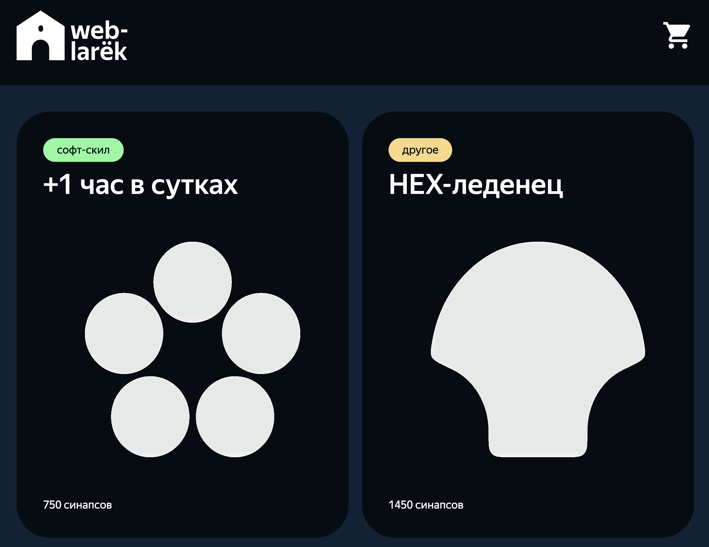
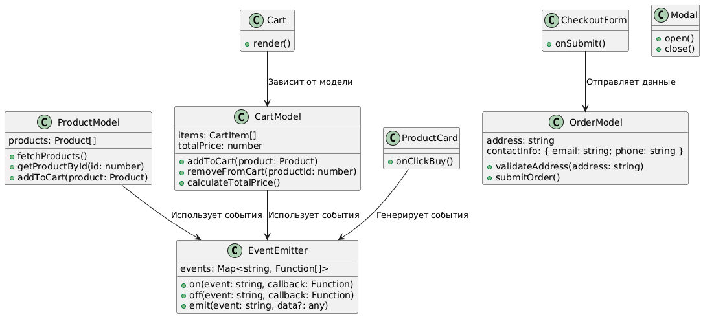

# Проект "Веб-ларёк"

**Стек технологий:**  
HTML, SCSS, TypeScript, Webpack

[Макет в Figma](https://www.figma.com/design/0KMR7HxUUMyRPMjuCvQEN1/Веб-ларёк?node-id=0-1)



---


## Описание проекта

Проект "Веб-ларёк" — это интернет-магазин для веб-разработчиков.  
Пользователи могут просматривать каталог товаров, добавлять товары в корзину и оформлять заказы.

### Особенности:

#### Главная страница:
- Отображение каталога товаров
- Модальное окно с информацией о товаре
- Иконка-кнопка для открытия корзины

#### Просмотр товара:
- Детальная информация
- Кнопка "Купить" и "Убрать из корзины"

#### Оформление заказа:
- Шаг 1: выбор оплаты и ввод адреса
- Шаг 2: ввод почты и телефона, подтверждение заказа
- Обработка ошибок и валидация

#### Общие требования:
- Закрытие модальных окон по клику вне области и по кнопке
- Активация кнопок только при выполнении условий

---


## Структура проекта

```
src/
├── common.blocks/           # SCSS-стили компонентов интерфейса
│   └── ...                  # basket.scss, button.scss, card.scss и др.
├── components/              # Логика и интерфейс
│   ├── base/                # Базовые утилиты
│   │   ├── EventEmitter.ts
│   │   └── api.ts
│   ├── models/              # Модели: CartModel, ProductModel, OrderModel
│   └── views/               # Отображение: ProductCard, CartView и др.
├── pages/
│   └── index.html           # Главная HTML-страница
├── scss/
│   ├── mixins/              # Миксины SCSS
│   ├── _variables.scss      # Переменные
│   └── styles.scss          # Главный файл стилей
├── types/
│   └── index.ts             # Все типы проекта
├── utils/
│   ├── constants.ts         # Константы
│   └── utils.ts             # Вспомогательные функции
├── images/                  # SVG и PNG иконки
│   └── logo.svg и др.
├── public/                  # Статические файлы (иконки, manifest и т.п.)
├── vendor/                  # Сторонние шрифты и библиотеки
└── index.ts                 # Точка входа приложения
```

### Важные файлы

- `src/pages/index.html` — HTML-файл главной страницы.
- `src/types/index.ts` — файл с типами TypeScript.
- `src/index.ts` — точка входа приложения.
- `src/scss/styles.scss` — корневой файл стилей.
- `src/utils/constants.ts` — файл с константами.
- `src/utils/utils.ts` — файл с утилитами.

---


## Установка и запуск

```bash
npm install
npm run start
```

или с Yarn:

```bash
yarn
yarn start
```

---

## Сборка проекта

```bash
npm run build
# или
yarn build
```

---


## Архитектура проекта (MVP)

Проект использует архитектурный подход Model–View–Presenter, который обеспечивает:

- Переиспользуемость компонентов
- Разделение логики и отображения
- Независимость компонентов — через EventEmitter и модель

Пример потока:  
View → Presenter → Model → Presenter → View

---


## Классы и их функциональность

1. **Класс `EventEmitter`:**
   - Реализует паттерн "Наблюдатель".
   - Позволяет подписываться на события и уведомлять подписчиков о наступлении события.
   - Методы: `on`, `off`, `emit`.
2. **Класс `ProductModel`:**
   - Работает с данными о товарах.
   - Методы:
     - `fetchProducts`: Получает список товаров с сервера.
     - `getProductById`: Возвращает товар по его ID.
3. **Класс `CartModel`:**
   - Управляет состоянием корзины.
   - Методы:
     - `addToCart`: Добавляет товар в корзину.
     - `removeFromCart`: Удаляет товар из корзины.
     - `calculateTotalPrice`: Вычисляет общую стоимость товаров в корзине.
4. **Класс `OrderModel`:**
   - Управляет процессом оформления заказа.
   - Методы:
     - `validateAddress`: Проверяет валидность адреса.
     - `submitOrder`: Отправляет заказ на сервер.

---


## UML-схема



---


## Типы данных

**API:**

```ts
export interface IProduct {
  id: string;
  title?: string;
  name?: string;
  price: number | null;
  description: string;
  category: string;
  image: string;
}

export type ApiListResponse<T> = {
  total: number;
  items: T[];
}
```

**Типы для корзины:**

```ts
export interface CartItem {
  product: IProduct;
  quantity: number;
}

export interface CartState {
  items: CartItem[];
  totalPrice: number;
}
```

**Типы для заказа и форм:**

```ts
export interface OrderData {
  address: string;
  payment: string;
  email: string;
  phone: string;
  items: string[];
  total: number;
}

export interface PaymentFormData {
  payment: string;
  address: string;
}

export interface ContactFormData {
  email: string;
  phone: string;
}
```

---


## Компоненты отображения

- ProductCard — карточка товара, генерирует событие `addToCart`
- Modal — универсальное модальное окно
- Cart — отображает корзину, реагирует на события `cart-change`, `cart-open`
- CheckoutForm — базовый класс формы оформления заказа
  - PaymentForm — способ оплаты и адрес
  - ContactForm — почта и телефон
- OrderSuccessModal — сообщение об успешном заказе

---


## Заключение

Проект "Веб-ларёк" построен на архитектуре MVP.  
Компоненты изолированы, типы описаны, структура прозрачна и легко масштабируется.  
Документация предназначена для быстрого погружения и дальнейшей разработки.

---


## Контакты

- GitHub: [https://github.com/achepin](https://github.com/achepin)  
- ВКонтакте: [https://vk.com/chepin](https://vk.com/chepin)