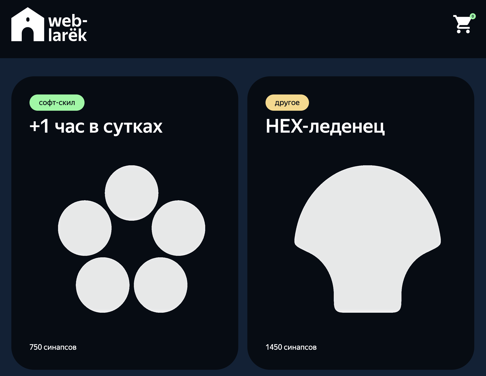
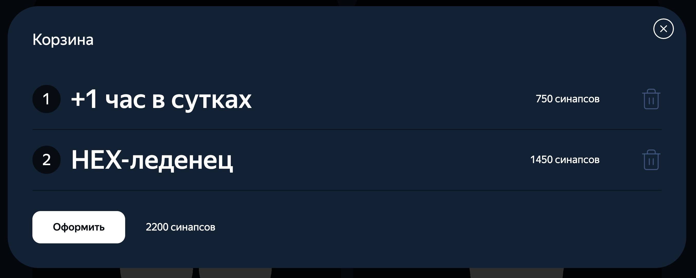
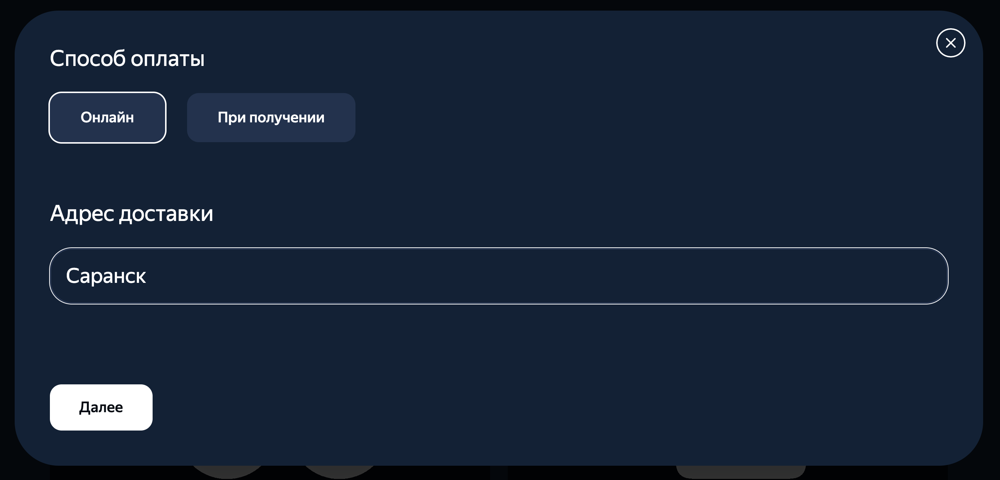
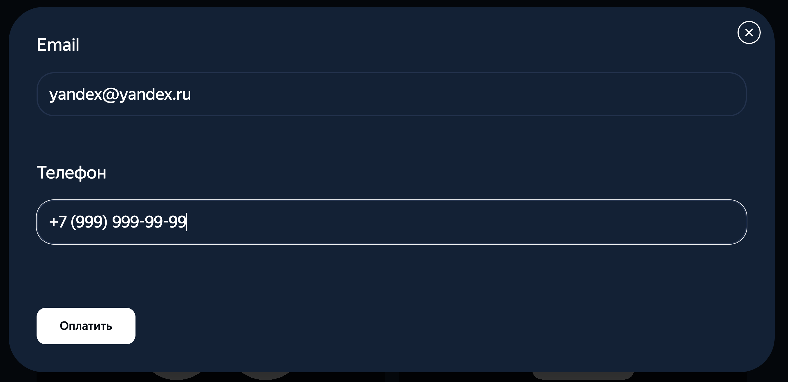
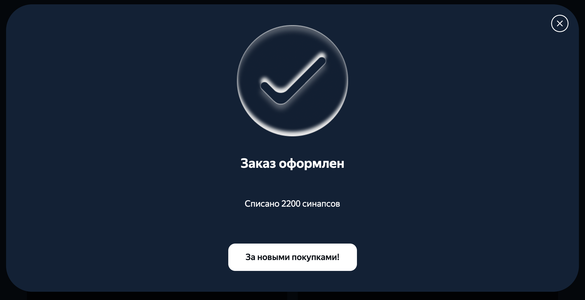
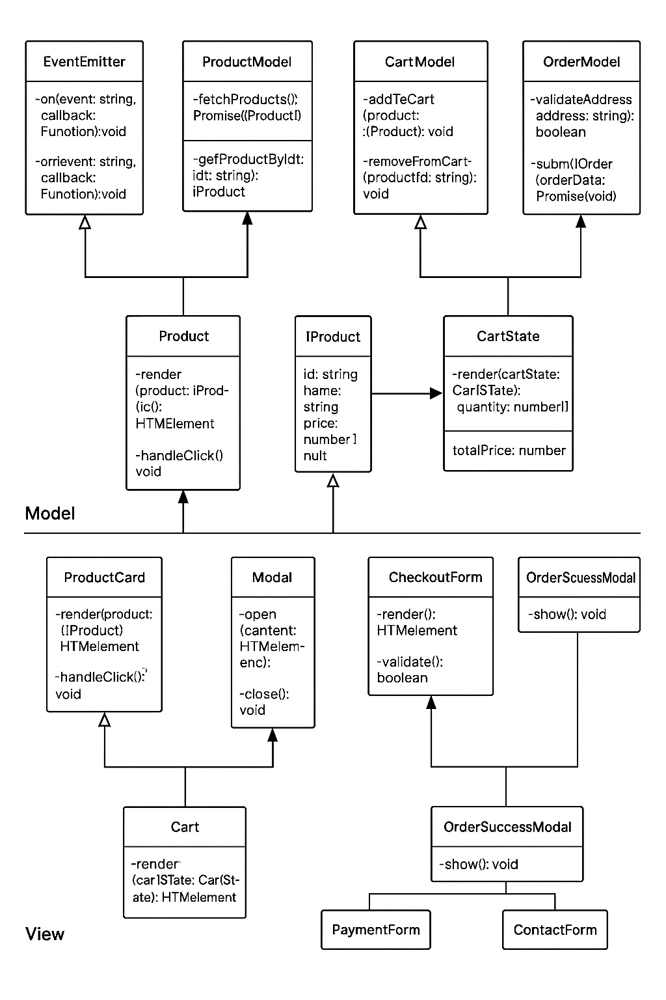

🔗 [Ссылка проекта на Github](https://github.com/achepin/web-larek-frontend.git)


# Веб-ларёк

**Стек:** TypeScript, HTML, SCSS, Webpack, REST API



## 📦 О проекте

**Веб-ларёк** — это учебный интернет-магазин для веб-разработчиков. Пользователь может просматривать каталог цифровых товаров, добавлять их в корзину и оформлять заказ в два этапа.

### 🚀 Функциональность

- Каталог товаров с карточками
- Модальное окно с детальной информацией
- Корзина с подсчетом итоговой суммы
- Двухшаговая форма заказа
- Подтверждение оформления с сообщением об успехе
- Валидация email и телефона
- Маска для ввода номера телефона
- Закрытие модалок по клику вне окна, по Esc и по кнопке

## 🧩 Структура проекта

```
src/
├── components/        // Компоненты (Cart, Modal, ProductCard, Form и др.)
│   └── base/          // Базовые утилиты (Api, EventEmitter)
├── pages/             // HTML-шаблон
├── scss/              // SCSS-модули
├── types/             // TypeScript-типизация
├── utils/             // Утилиты и константы
├── index.ts           // Главная логика (точка входа)
```

## 📂 Ключевые файлы

- `index.ts` — основной скрипт
- `api.ts` — взаимодействие с API
- `card.scss` — стили карточек
- `modal.ts` — управление модалками
- `basket.ts` — логика корзины
- `order.ts` — оформление заказа
- `scss/styles.scss` — объединённые стили

## 🛠 Установка

```bash
npm install
npm run start
```

или

```bash
yarn
yarn start
```

## 📦 Сборка

```bash
npm run build
```

или

```bash
yarn build
```

## 📋 Архитектура и взаимодействие

Проект реализован по паттерну MVP:

**View → Presenter → Model → Presenter → View**

- `ProductCard` рендерит карточку товара.
- При клике происходит `emit('add-to-cart')`.
- `CartModel` добавляет товар и генерирует `cart-change`.
- `Cart` подписан на `cart-change` и обновляет интерфейс.

## ✅ Валидация

- Email проверяется по регулярному выражению.
- Телефон вводится по маске `+7 (999) 999-99-99`.
- Отображаются сообщения об ошибках.
- Кнопка "Оплатить" активируется только при валидных данных.

## 🖼 Визуал

- Адаптация под макет из Figma
- Категории товаров подсвечиваются цветом
- SVG-иконки подключаются через CDN и стилизуются через SCSS
- Тени, отступы, шрифты — строго по макету

## 💡 Особенности

- Используется API: [https://larek-api.nomoreparties.co](https://larek-api.nomoreparties.co)
- Работает без перезагрузки страницы
- Все стили через SCSS-модули
- Чистый, модульный TypeScript-код

## 📎 Скриншоты










---

## Расширенное описание компонентов



### Модель данных (Model)

Модель данных отвечает за хранение и управление состоянием приложения. Она изолирована от UI и предоставляет API для чтения и изменения состояния. Все изменения состояния инициируются через событийную систему.

- **`EventEmitter`**: реализует шаблон Publisher-Subscriber. Используется для связи между компонентами без жёсткой зависимости.
- **`ProductModel`**: управляет загрузкой и хранением списка товаров. Предоставляет доступ к отдельным товарам.
- **`CartModel`**: хранит текущие товары в корзине, позволяет добавлять/удалять товары и рассчитывает итоговую стоимость.
- **`OrderModel`**: управляет процессом оформления заказа, включая валидацию адреса и отправку данных на сервер.

### Представление (View)

Компоненты представления отображают данные, полученные от модели, и отправляют действия пользователя обратно через события.

- **`ProductCard`**: визуальное представление товара. Содержит изображение, категорию, название и цену. Обрабатывает клик на кнопку «Купить».
- **`Modal`**: универсальный компонент для отображения всплывающих окон. Используется для карточки товара, корзины и этапов оформления заказа.
- **`Cart`**: визуально представляет корзину покупок. Отображает список добавленных товаров, общую сумму и кнопку для перехода к оформлению заказа.
- **`OrderSuccessModal`**: отображает финальное сообщение об успешном оформлении заказа. Предоставляет пользователю обратную связь и возможность закрыть окно.
- **`CheckoutForm`**: абстрактный класс для форм заказа. Делится на два экрана:
  - **`PaymentForm`**: содержит выбор способа оплаты и поле адреса.
  - **`ContactForm`**: содержит поля для ввода email и телефона.

### Контроллеры (Презентеры)

Контроллеры обрабатывают события из UI и взаимодействуют с моделью. Они слушают события от компонентов представления, обновляют модель и вызывают обновление отображения.

---

## Валидация и UX

- Поля формы не позволяют отправку до тех пор, пока не заполнены корректно.
- Email проверяется с помощью регулярного выражения.
- Телефон форматируется автоматически и проверяется на длину.
- Модальные окна можно закрыть с помощью:
  - Кнопки закрытия
  - Клика вне окна
  - Нажатия Escape

---

## Дополнительная информация

### Стилизация

Стили написаны с использованием SCSS и организованы по компонентам. Подключается общий файл `styles.scss`, где импортируются переменные, миксины и отдельные компоненты стилей (`card.scss`, `modal.scss`, `order.scss` и др.).

Используются переменные из `_variables.scss` для соблюдения единой цветовой схемы и размеров.

### Работа с изображениями

SVG-изображения товаров подключаются динамически, сохраняют стилизацию через SCSS и кастомные свойства.

---

Проект "Веб-ларёк" — это отличная основа для обучения принципам работы SPA-приложений, реализации архитектуры MVP и работы с UI-компонентами, событиями и состоянием приложения.


## 📬 Контакты

- Автор: Алексей Чепин
- [GitHub](https://github.com/achepin)
- [VK](https://vk.com/chepin)