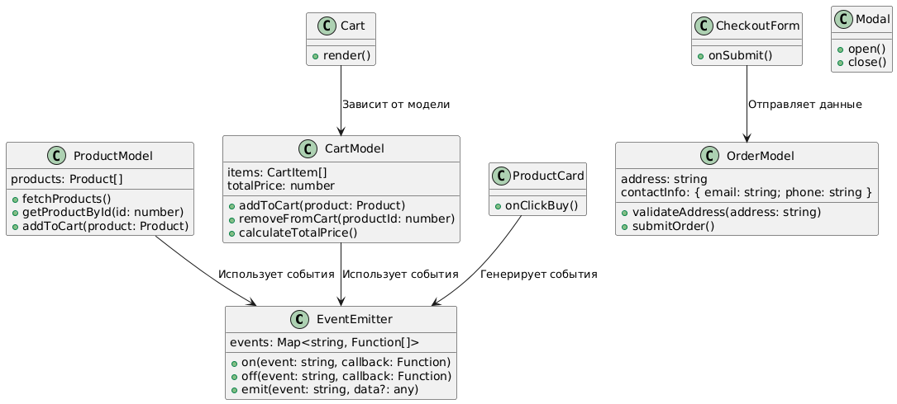

```markdown
# Проектная работа "Веб-ларек"

**Стек:** HTML, SCSS, TypeScript, Webpack

---

## Структура проекта

```
src/ — исходные файлы проекта
  src/components/ — папка с JS компонентами
    src/components/base/ — папка с базовым кодом
```

### Важные файлы
- `src/pages/index.html` — HTML-файл главной страницы.
- `src/types/index.ts` — файл с типами TypeScript.
- `src/index.ts` — точка входа приложения.
- `src/scss/styles.scss` — корневой файл стилей.
- `src/utils/constants.ts` — файл с константами.
- `src/utils/utils.ts` — файл с утилитами.

---

## Установка и запуск

Для установки и запуска проекта выполните следующие команды:

```bash
npm install
npm run start
```

Или, если вы используете Yarn:

```bash
yarn
yarn start
```

---

## Сборка проекта

Для сборки проекта выполните:

```bash
npm run build
```

Или, если вы используете Yarn:

```bash
yarn build
```

---

## Описание проекта

### Цель проекта
Проект "Веб-ларёк" представляет собой интернет-магазин для веб-разработчиков. Пользователи могут просматривать каталог товаров, добавлять товары в корзину и оформлять заказы.

### Функциональные возможности
1. **Главная страница**:
   - Отображение каталога товаров.
   - Модальное окно с детальной информацией о товаре.
   - Возможность открыть корзину через иконку.

2. **Просмотр товара**:
   - Детальная информация о товаре.
   - Кнопка "Купить" для добавления товара в корзину.
   - Кнопка "Убрать" для удаления товара из корзины.

3. **Оформление заказа**:
   - Первый шаг: выбор способа оплаты и ввод адреса доставки.
   - Второй шаг: ввод контактных данных (почта, телефон) и подтверждение заказа.
   - Обработка ошибок при незаполненных полях.

4. **Общие требования**:
   - Модальные окна закрываются по клику вне окна или на кнопку "Закрыть".
   - Кнопки активируются только после выполнения необходимых действий.

---

## Архитектура проекта

### Базовый код
#### Классы и их функциональность
1. **Класс `EventEmitter`:**
   - Реализует паттерн "Наблюдатель".
   - Позволяет подписываться на события и уведомлять подписчиков о наступлении события.
   - Методы: `on`, `off`, `emit`.

2. **Класс `ProductModel`:**
   - Работает с данными о товарах.
   - Методы:
     - `fetchProducts`: Получает список товаров с сервера.
     - `getProductById`: Возвращает товар по его ID.

3. **Класс `CartModel`:**
   - Управляет состоянием корзины.
   - Методы:
     - `addToCart`: Добавляет товар в корзину.
     - `removeFromCart`: Удаляет товар из корзины.
     - `calculateTotalPrice`: Вычисляет общую стоимость товаров в корзине.

4. **Класс `OrderModel`:**
   - Управляет процессом оформления заказа.
   - Методы:
     - `validateAddress`: Проверяет валидность адреса.
     - `validateContactInfo`: Проверяет валидность контактных данных.
     - `submitOrder`: Отправляет заказ на сервер.

---

### Типы данных
#### Типы для API
```typescript
export interface Product {
  id: number;
  name: string;
  price: number;
  description: string;
}

export interface ApiResponse {
  products: Product[];
}
```

#### Типы для моделей
```typescript
export interface CartItem {
  product: Product;
  quantity: number;
}

export interface CartState {
  items: CartItem[];
  totalPrice: number;
}
```

---

### Компоненты отображения
1. **Компонент `ProductCard`:**
   - Отображает карточку товара.
   - При клике на кнопку "Купить" генерируется событие `addToCart`.

2. **Компонент `Modal`:**
   - Отвечает за модальные окна.
   - Закрывается по клику вне окна или на кнопку "Закрыть".

3. **Компонент `Cart`:**
   - Отображает содержимое корзины.
   - Позволяет удалить товар или изменить количество.

4. **Компонент `CheckoutForm`:**
   - Отвечает за форму оформления заказа.
   - Включает поля для ввода адреса и контактных данных.

---

### Взаимодействие между компонентами
- При клике на кнопку "Купить" в компоненте `ProductCard` генерируется событие `addToCart`.
- Компонент `Cart` подписывается на событие `addToCart` через `EventEmitter` и обновляет состояние корзины.
- При оформлении заказа компонент `CheckoutForm` отправляет данные на сервер через `OrderModel`.

---

## UML-схема




### Описание

1. **EventEmitter** : Брокер событий, который связывает компоненты.
2. **ProductModel** : Модель для работы с данными о товарах.
3. **CartModel** : Модель корзины.
4. **OrderModel** : Модель оформления заказа.
5. **ProductCard** : Компонент карточки товар
6. **Modal** : Компонент модального окна.
7. **Cart** : Компонент корзины.
8. **CheckoutForm** : Форма оформления заказа.

---


## Заключение

Проект "Веб-ларёк" реализует интернет-магазин для веб-разработчиков с использованием современных технологий и MVP-архитектуры. Все типы данных описаны в директории `src/types/`, а компоненты разделены на модели, представления и контроллеры.

Эта документация поможет вам разобраться в структуре проекта и продолжить его разработку.

