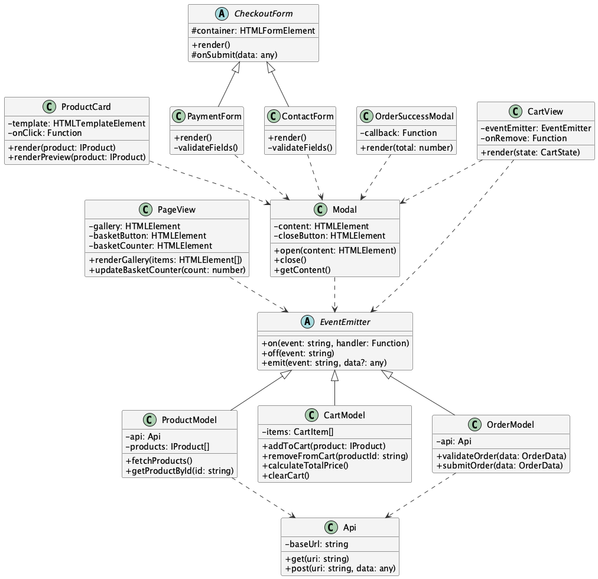

# Проект "Веб-ларёк"

**Стек технологий:**  
HTML, SCSS, TypeScript, Webpack

[Макет в Figma](https://www.figma.com/design/0KMR7HxUUMyRPMjuCvQEN1/Веб-ларёк?node-id=0-1)


---


## Описание проекта

Проект "Веб-ларёк" — это интернет-магазин для веб-разработчиков.  
Пользователи могут просматривать каталог товаров, добавлять товары в корзину и оформлять заказы.

### Особенности:

#### Главная страница:
- Отображение каталога товаров
- Модальное окно с информацией о товаре
- Иконка-кнопка для открытия корзины
- Адаптивная галерея товаров

#### Просмотр товара:
- Детальная информация
- Кнопка "Купить" (недоступна для бесценных товаров)
- Кнопка "Убрать из корзины"

#### Оформление заказа:
- Шаг 1: выбор оплаты и ввод адреса
- Шаг 2: ввод почты и телефона, подтверждение заказа
- Обработка ошибок и валидация
- Автоматическая очистка корзины после успешного оформления

#### Особенности работы с товарами:
- Бесценные товары (price === null) нельзя добавить в корзину
- Корзина очищается автоматически после успешного оформления заказа
- Модальные окна всегда отображаются по центру видимой области экрана

#### Общие требования:
- Закрытие модальных окон по клику вне области и по кнопке
- Активация кнопок только при выполнении условий
- Валидация всех форм перед отправкой

---


## Структура проекта

```
src/
├── common.blocks/                # SCSS-стили для визуальных блоков интерфейса (по БЭМ)
│   ├── basket.scss
│   ├── button.scss
│   ├── card.scss
│   ├── form.scss
│   ├── gallery.scss
│   ├── header.scss
│   ├── modal.scss
│   ├── order-success.scss
│   ├── order.scss
│   └── page.scss
│
├── components/                   # Компоненты приложения по слоям архитектуры
│   ├── base/                     # Базовые утилиты
│   │   ├── EventEmitter.ts       # Паттерн "Наблюдатель" — система событий
│   │   └── api.ts                # Класс-обёртка для работы с API
│   │
│   ├── models/                   # Слой Model — бизнес-логика и данные
│   │   ├── ProductModel.ts       # Загрузка и хранение списка товаров
│   │   ├── CartModel.ts          # Управление корзиной, события, суммы
│   │   ├── OrderModel.ts         # Валидация и отправка заказов
│   │   └── cart.ts               # Вспомогательный модуль (может быть удалён)
│   │
│   └── views/                    # Слой View — отображение интерфейса
│       ├── ProductCard.ts        # Генерация карточки товара и её превью
│       ├── CartView.ts           # Отображение содержимого корзины
│       ├── Modal.ts              # Универсальный модальный контейнер
│       ├── CheckoutForm.ts       # Абстрактный класс для форм заказа
│       ├── PaymentForm.ts        # Шаг 1: способ оплаты и адрес
│       ├── ContactForm.ts        # Шаг 2: email и телефон
│       ├── OrderSuccessModal.ts  # Сообщение об успешном заказе
│       └── PageView.ts           # Контейнер главной страницы
│
├── docs/                         # Документация, изображения, UML-диаграммы
│   ├── Larek.png
│   └── UML.png
│
├── images/                       # Иконки и изображения
│   ├── Subtract.png / .svg
│   ├── logo.svg
│   ├── shopping_cart.svg
│   ├── trash.svg / trash-2.svg
│   └── x-circle.svg
│
├── pages/
│   └── index.html                # HTML-шаблон страницы
│
├── public/                       # Статические ресурсы (иконки, манифест и др.)
│   ├── favicon.*.png / .ico
│   ├── manifest.json
│   ├── browserconfig.xml
│   ├── safari-pinned-tab.svg
│   └── .nojekyll                 # Отключение обработки GitHub Pages
│
├── scss/                         # Стили и SCSS-структура проекта
│   ├── mixins/                   # Примеси
│   │   ├── _background.scss
│   │   ├── _container.scss
│   │   ├── _fix.scss
│   │   ├── _icon.scss
│   │   ├── _index.scss
│   │   └── _interactive.scss
│   ├── _variables.scss           # Глобальные переменные (цвета, размеры и др.)
│   └── styles.scss               # Точка входа для сборки всех стилей
│
├── types/                        # Глобальные интерфейсы TypeScript
│   └── index.ts                  # Типы для API, заказов, товаров, корзины
│
├── utils/                        # Утилиты и константы проекта
│   ├── constants.ts              # Настройки, переменные окружения
│   └── utils.ts                  # Вспомогательные функции
│
├── vendor/                       # Сторонние ресурсы: шрифты, нормалайз
│   ├── garamond/                 # Шрифт EB Garamond
│   ├── glyphter/                 # Иконочный шрифт Glyphter
│   ├── ys-text/                  # Семейство шрифтов Yandex Sans Text / Display
│   └── normalize.css             # Сброс дефолтных стилей
│
└── index.ts                      # Главная точка входа в приложение
```

### Важные файлы

- `src/pages/index.html` — HTML-файл главной страницы.
- `src/types/index.ts` — файл с типами TypeScript.
- `src/index.ts` — точка входа приложения.
- `src/scss/styles.scss` — корневой файл стилей.
- `src/utils/constants.ts` — файл с константами.
- `src/utils/utils.ts` — файл с утилитами.

---


## Установка и запуск

```bash
npm install
npm run start
```

или с Yarn:

```bash
yarn
yarn start
```

---

## Сборка проекта

```bash
npm run build
# или
yarn build
```

---


## Архитектура проекта (MVP)

Проект использует архитектурный подход Model–View–Presenter, который обеспечивает:

- Переиспользуемость компонентов
- Разделение логики и отображения
- Независимость компонентов — через EventEmitter и модель

Пример потока:  
View → Presenter → Model → Presenter → View

---


## Классы и их функциональность

1. **Класс `EventEmitter`:**
   - Реализует паттерн "Наблюдатель".
   - Позволяет подписываться на события и уведомлять подписчиков о наступлении события.
   - Методы: `on`, `off`, `emit`.
2. **Класс `ProductModel`:**
   - Работает с данными о товарах.
   - Методы:
     - `fetchProducts`: Получает список товаров с сервера.
     - `getProductById`: Возвращает товар по его ID.
3. **Класс `CartModel`:**
   - Управляет состоянием корзины.
   - Методы:
     - `addToCart`: Добавляет товар в корзину.
     - `removeFromCart`: Удаляет товар из корзины.
     - `calculateTotalPrice`: Вычисляет общую стоимость товаров в корзине.
4. **Класс `OrderModel`:**
   - Управляет процессом оформления заказа.
   - Методы:
     - `validateAddress`: Проверяет валидность адреса.
     - `submitOrder`: Отправляет заказ на сервер.
5. **Класс `PageView`:**
   - Отвечает за отображение главной страницы.
   - Методы:
     - `renderGallery`: Отображает товары в галерее.
     - `updateBasketCounter`: Обновляет счетчик товаров в корзине.
6. **Класс `Modal`:**
   - Управляет модальными окнами.
   - Особенности:
     - Центрирование окна в видимой области
     - Блокировка прокрутки страницы
     - Закрытие по ESC и клику вне окна
     - Сохранение состояния форм при переключении

---


## UML-схема



---


## Типы данных

**Базовые интерфейсы:**
```ts
// Интерфейс события
export interface IEvents {
    on<T>(event: string, handler: (data: T) => void): void;
    off(event: string): void;
    emit<T>(event: string, data?: T): void;
}

// Интерфейс для HTTP API
export interface IApi {
    readonly baseUrl: string;
    get<T>(uri: string): Promise<T>;
    post(uri: string, data: object, method?: string): Promise<object>;
}

// Базовый интерфейс модального окна
export interface IModalWindow {
    content: HTMLElement;
    open(): void;
    close(): void;
    render(): HTMLElement;
}
```

**API и модели:**
```ts
// Тип данных для одного товара
export interface IProduct {
  id: string;                    // Уникальный идентификатор товара
  title?: string;                // Название товара (из API)
  name?: string;                 // Название товара (внутреннее использование)
  price: number | null;          // Цена товара (null для бесценных товаров)
  description: string;           // Подробное описание товара
  category: string;              // Категория (например, "UI", "Backend" и т.д.)
  image: string;                 // Ссылка на изображение товара
}

// Типизированный ответ от API
export type ApiListResponse<T> = {
  total: number;                 // Общее количество товаров
  items: T[];                    // Массив объектов типа T
};

export type ApiPostMethods = 'POST' | 'PUT' | 'DELETE';
```

**Корзина и заказы:**
```ts
// Товар в корзине
export interface CartItem {
  product: IProduct;             // Экземпляр товара
  quantity: number;              // Количество единиц товара
}

// Состояние корзины
export interface CartState {
  items: CartItem[];            // Список товаров
  totalPrice: number;           // Общая сумма
}

// Данные заказа
export interface OrderData {
  address: string;              // Адрес доставки
  payment: string;              // Способ оплаты
  email: string;                // Email покупателя
  phone: string;                // Телефон покупателя
  items: string[];              // ID товаров
  total: number;                // Сумма заказа
}
```

**Формы и валидация:**
```ts
// Данные формы оплаты
export interface PaymentFormData {
  payment: string;              // Способ оплаты
  address: string;              // Адрес доставки
}

// Данные формы контактов
export interface ContactFormData {
  email: string;                // Email
  phone: string;                // Телефон
}

// Ошибки форм
export type FormErrors = string[];

// События форм
export type FormFieldName = 
  | 'payment'
  | 'address'
  | 'email'
  | 'phone';
```

**Служебные типы:**
```ts
// Типы событий приложения
export type EventName = 
  | 'cart:open'
  | 'cart:change'
  | 'order:submit'
  | 'order:success'
  | 'products:updated';

// Селекторы элементов
export type SelectorElement<T> = T | string;
export type SelectorCollection<T> = string | NodeListOf<Element> | T[];
```

---


## Компоненты отображения

- ProductCard — карточка товара, адаптивное отображение информации о товаре
- Modal — универсальное модальное окно с поддержкой блокировки прокрутки
- Cart — отображает корзину, реагирует на события `cart-change`, `cart-open`
- CheckoutForm — базовый класс формы оформления заказа
  - PaymentForm — способ оплаты и адрес с валидацией полей
  - ContactForm — почта и телефон с масками ввода и валидацией
- OrderSuccessModal — сообщение об успешном заказе
- PageView — управление главной страницей и интерфейсом


## Взаимодействие компонентов

1. **Процесс покупки:**
   - Просмотр каталога → Открытие карточки товара
   - Добавление в корзину → Управление количеством
   - Оформление заказа → Валидация данных
   - Отправка на сервер → Очистка корзины

2. **Обработка событий:**
   - `cart-change`: обновление состояния корзины
   - `order:submit`: начало оформления заказа
   - `order:success`: успешное оформление
   
3. **Валидация данных:**
   - Проверка адреса и способа оплаты
   - Валидация email и телефона
   - Проверка наличия товаров в корзине
   - Защита от добавления бесценных товаров

---


## Заключение

Проект "Веб-ларёк" построен на архитектуре MVP.  
Компоненты изолированы, типы описаны, структура прозрачна и легко масштабируется.  
Документация предназначена для быстрого погружения и дальнейшей разработки.

---


## Контакты

- GitHub: [https://github.com/achepin](https://github.com/achepin)  
- ВКонтакте: [https://vk.com/chepin](https://vk.com/chepin)